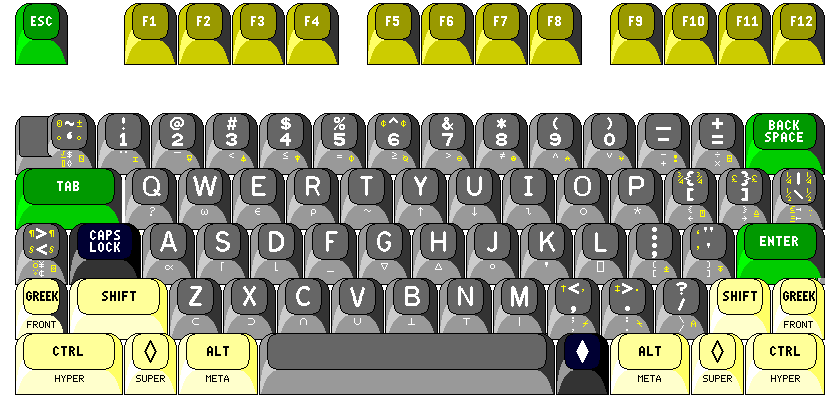
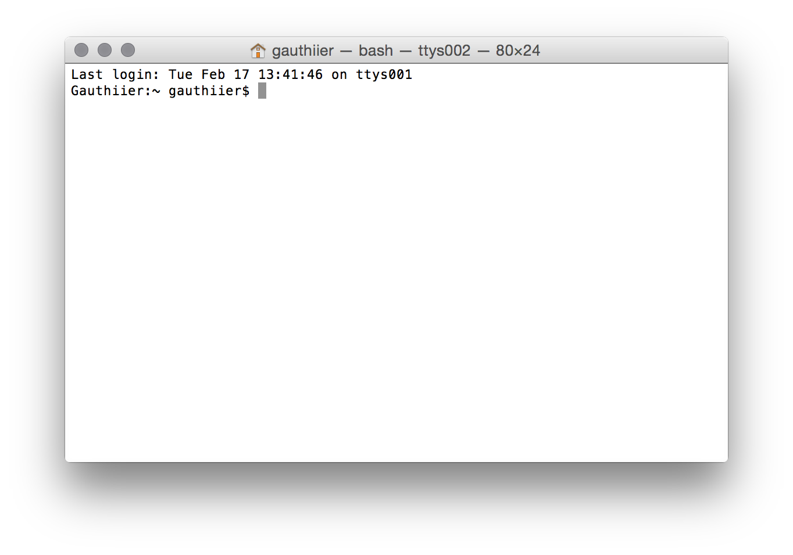

# CLI or the Command Line Interface

The Command Line Interface is the most common and pervasive interface directly linking fingers typing on a keyboard (text) and the computer (commands). The CLI is a legacy mode of operating computing system which can be traced back to early telegraphic devices. In this lesson we will look at your computer's own CLI and present ways in which you can use it to write, manipulate, analyse and transform text on your own computer system.

### Goals

The aim of this lesson is for readers to develop an appreciation of the advantages of using the CLI for certain types of work involving text editing on a computer. As the CLI itself is text based, our goal is to present the history of the CLI and discuss how text-based computer interfaces are still up to this day on of the most important ways to communicate with the computer systems.

The goals of this lesson are:

1. Acquire basic knowledge on how to operate the CLI of your own computer. 
2. Acquire just-enough CLI vocabulary to be used in future work.

### How

To access to the Command Line Interface of your computer you need a Command Line Interpreter. Every mdoern Operating System (OS) have such interpreter built-in. In fact, the Command Line Interpreter are legacy systems on most OS (OSX, Windows, Linux, Unix, etc.) because there was a time when interfacing with a computer was solely done typing commands on a terminal.[^1] Most computer programmers, even nowadays, use the computer CLI on a daily basis to write and run software and even to debug hardware.  

Depending on which OS you are using, accessing its CLI is quite simple:

- On OSX, the "Terminal" application resides in the "Utilities" folder under "Applications".

- On Windows, you access the CMD.EXE command prompt by typing "cmd" in the search bar of the "Start" menu 

On OSX your CLI should look like:

Bingo! Say hello to the computer's CLI!

Now in order to utilise the CLI in a productive way you need to learn a couple of fundamental commands.

1. "ls" (OSX, Linux, Unix) and "dir" (Windows): lists all files and folders inside the directory your CLI's current working directory.
	
2. "cd": changes the CLI's current working directory

Using both commands, you can basically navigate your whole filesystem. It is important at this point to understand the idea of a "working directory" as commands issued on the CLI usually depends in the files present in its "working directory".

We are now going to illustrate some useful commands (under OSX) that deal with text files and the likes. Hence, we will point our "shell" (another common name for the CLI) to the folder containing the files of this site.

Issuing the "ls" command results in:

	Gauthiier:wwwriting gauthiier$ ls
	Lesson1.html  Lesson2.md    Lesson5.md    index.html    wwwrite.bib
	Lesson1.md    Lesson3.md    Lesson6.md    index.md
	Lesson2.html  Lesson4.md    img/          style/
	
As you can see, directories are denoted with a leading "/" while files are not. Hence, "img/" is a directory and "Lesson1.md" is a file.

It is possible to list the content of directories using "ls" without changing the "working directory". For example, let's list the content of the directory "style/":

	Gauthiier:wwwriting gauthiier$ ls style/
	style.css       template.html5
	
Ok now let's play with file (meta)data.

The command "file" can tell you what type a file is. For example:

	Gauthiier:wwwriting gauthiier$ file wwwrite.bib 
	wwwrite.bib: UTF-8 Unicode English text, with very long lines

The command "wc" (word count) returns information about the content of the file:

	Gauthiier:wwwriting gauthiier$ wc Lesson1.md
     118    1995   13100 Lesson1.md

where (1) the first column indicates the number of lines, (2) the second column the number of words and (3) the third column the number of bytes.

The command "grep" matches words to files that contain them (search). "grep" can search a specific file or lookup files recursively in a directory.

Let's look up the word: wwword.

	Gauthiier:wwwriting gauthiier$ grep "wwword" Lesson2.md
	Let's look up the word: wwword.

"grep" gives the exact line-text where the word in found in the file.

Similarly we can look up the number of times a word appears in each files ending with .md or .html in the current working directory:

	Gauthiier:wwwriting gauthiier$ grep -rc --include=*.{md,html} "wwword" .
	./index.html:0
	./index.md:0
	./Lesson1.html:0
	./Lesson1.md:0
	./Lesson2.html:3
	./Lesson2.md:3
	./Lesson3.md:0
	./Lesson4.md:0
	./Lesson5.md:0
	./Lesson6.md:0

As you can see the command "grep" can be instructed, using certain command parameters, to perform quite advanced searches. In general all commands from the CLI have specific parameters that can be set to specify a specific ways in which to conduct their operations. 

It is, of course, out of the scope of this lesson to present all possible commands one can use to manipulate files and directories. For the remaining lessons, you only have to remember how to point your CLI to a specific working directory.

### Extra

[OSX Unix Tutorial for Beginners](http://acad.coloradocollege.edu/dept/PC/sciCompLab/UnixTutorial/)

[A beginners guide to the Command Prompt (Windows)](http://www.codejacked.com/a-beginners-guide-to-the-command-prompt)

A list of all commands: [OSX](http://ss64.com/osx/) - [Windows](http://ss64.com/nt/)

[^1]: Something that is easily forgotten in the era of ubiquitous computer Graphical User Interface (GUI). The CLI is to some degree reminescent of the Teletype (TTY).